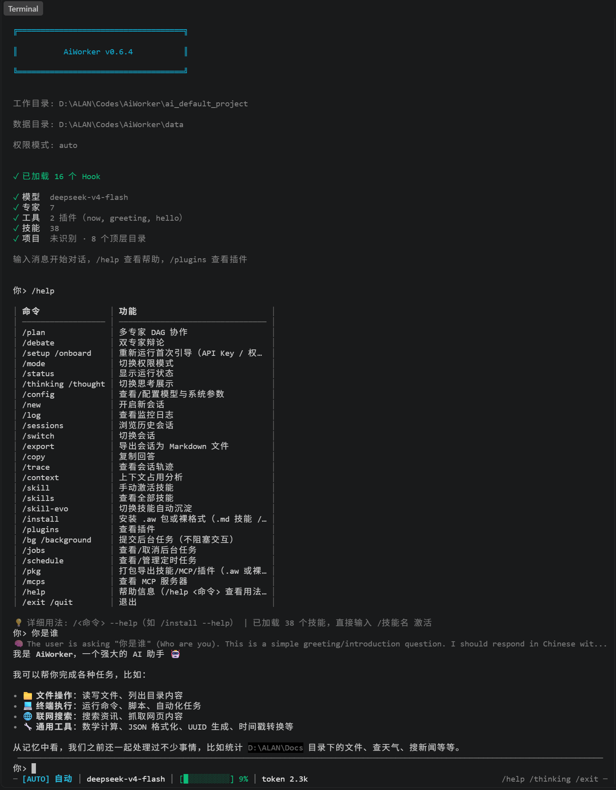
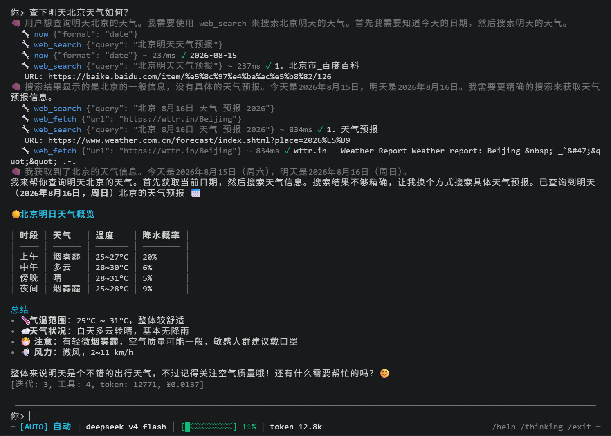
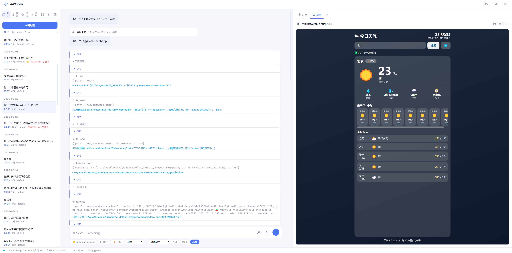
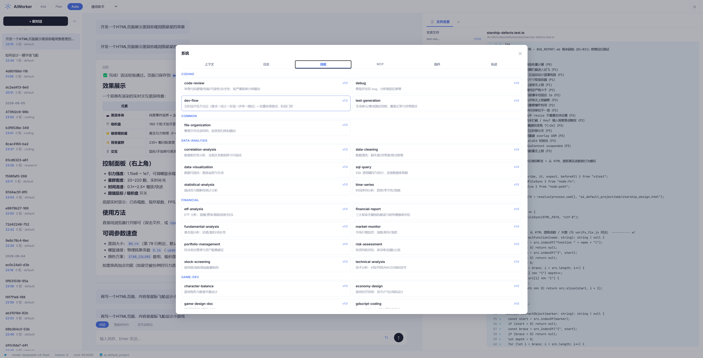
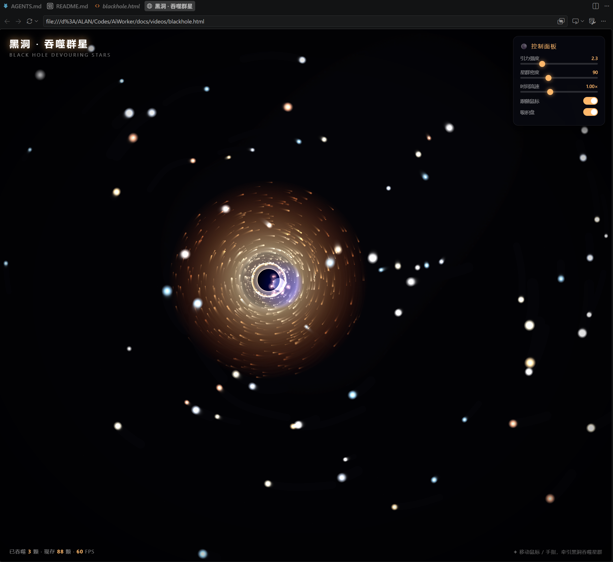
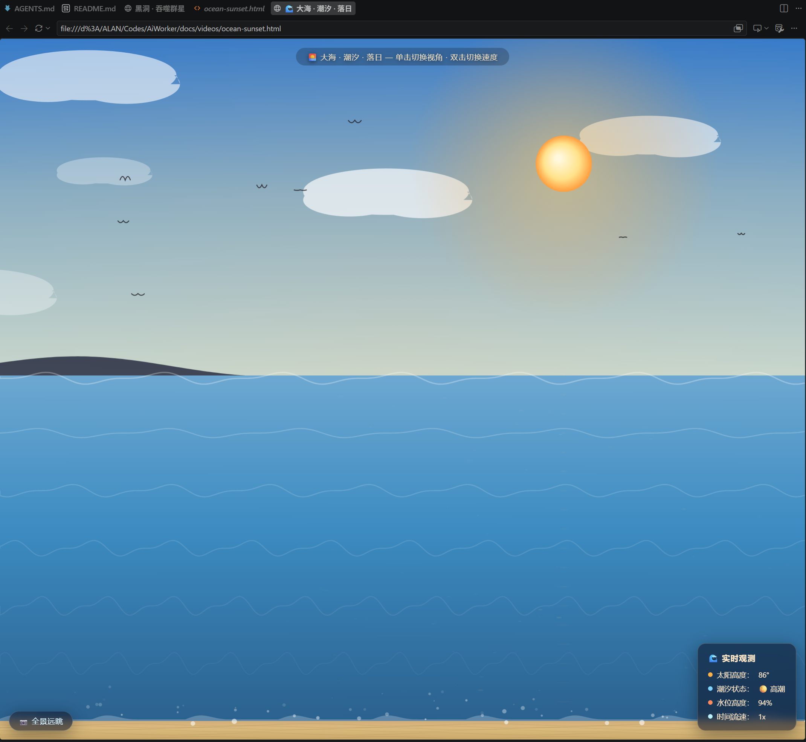
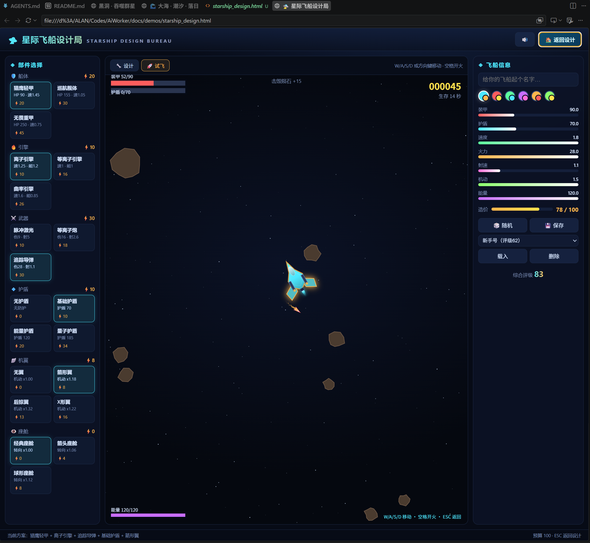

# AiWorker

> 个人 AI Agent 助手 — 多智能体协作 + MCP + Skills + Hooks + 自进化

<!-- 版本徽章与 package.json 同步更新 -->


一套运行在本地的个人 AI Agent 助手：多专家智能体按任务自动路由，支持工具调用、MCP 协议、技能库自动匹配、生命周期 Hook、三层记忆与上下文压缩。提供 **TUI 终端** 与 **Web UI** 两种交互界面。

## 目录

- [特性](#特性)
- [界面预览](#界面预览)
- [作品展示](#作品展示)
- [快速开始](#快速开始)
- [交互界面](#交互界面)
- [项目结构](#项目结构)
- [配置](#配置)
- [插件开发](#插件开发)
- [测试与开发](#测试与开发)
- [技术栈](#技术栈)
- [相关文档](#相关文档)
- [许可证](#许可证)

## 特性

**Agent 核心**
- 流式逐 token 输出 + AbortSignal 中断 + 空响应断路器 + **防循环提醒**（连续相同工具调用自动注入提示）+ token 压缩（75% 阈值，保留最近 3-8 轮）
- **迭代预算管理**：每专家可配上限（`config/agents/*.yaml` 或 `/config iterations` 运行时调整）；剩余 ≤5 轮自动注入收敛提示；重复调用/工具全失败自动终止防 token 浪费；撞顶返回进展摘要
- 多 profile 模型路由：coding / reasoning / writing / creative / lite + DeepSeek 思考模式（`extra_body`）
- 7 个专家智能体：通用 / 研究 / 编码 / 数据分析 / 理财 / 游戏 / 产品运营，关键词正则 → LLM 语义两阶段路由
- Team 协调器：`/plan` DAG 编排（4 种模板 + Kahn 环路检测）、`/debate` 双专家互审

**工具与扩展**
- 8 个内置工具：fs_read / fs_write / fs_list / terminal_exec（异步）/ **terminal_session（持久终端，cd/env 跨调用保留）** / web_search（Bing 零 key）/ web_fetch（15s 超时）/ **ask_user（模型主动向用户提问，CLI stdin / Web 提问卡片）**
- MCP 协议：stdio/HTTP 双传输 + 内置工具服务器（math_eval/uuid_gen/json_format/timestamp_convert）+ 自动重连 + 健康检查
- 38 个技能（7 大领域）：SKILL.md 正则触发 + 依赖缺失自动降级 + 复杂任务后自沉淀（可开关）
- **轻量插件系统**：`config/plugins/` 即插即用——`setup(ctx)` 注册自定义工具/Hook（默认全局可见，可限定专家作用域），`/plugins` 查看状态；同名冲突 ⚠ 警告、Hook 错误隔离（fail-soft，插件 bug 不崩任务）
- **scoped 工具注册**：工具按专家遮蔽（同名遮蔽全局），模型只见自己专家的工具（`mcp_`/插件工具豁免白名单）

**安全与合规**
- Ask / Plan / Auto 三权限模式 + 危险操作正则拦截 + 路径遍历防护（写入锁死在工作目录内）
- **审批服务（ApprovalService）**：权限决策单点（模式矩阵 + fail-closed，无确认通道默认拒绝），hooks 内权限 handler 均为薄委托
- **策略化命令沙箱**（`config/sandbox.json`）：terminal_exec 工作目录越界拦截（fail-closed）+ 配置化命令黑名单 + 执行时剥离敏感环境变量（KEY/TOKEN/SECRET）
- **工具调用统一超时护栏**（默认 60s），任何工具不会无限挂起
- Hooks 5 生命周期点 + 14 个 Handler：敏感数据过滤 / 高危确认 / 权限检查 / Diff 快照 / 审计日志 / 重试退避 / 模型降级

**记忆与上下文**
- 三层记忆：工作记忆（SQLite）+ 情景记忆（FTS5 + 中文分词 + 时间衰减）+ 语义记忆（MEMORY.md/USER.md 有界管理）
- **会话事件溯源**：`session_events` 仅追加日志作为唯一真源，消息/轮次/工具调用可回放派生（`/trace`、统计、遥测共用）
- **超长工具结果落盘（spill）**：fs_read/terminal 输出 > 8000 字符自动写入 `data/spills/`，上下文只留定位符 + 预览（replay-safe）
- **工具结果剪枝**：上下文组装时超长 tool 消息截断 + 标记（完整内容仍在事件日志）
- **会话自动标题**：首条用户消息自动生成（首行截断 ≤24 字符，不覆盖手动重命名）
- 上下文管理：冻结快照 + 自适应压缩 + 分层 token 占比统计（`/context`）+ 工作目录感知（ProjectProfiler）
- 监控日志：轮次日志（TurnLog）+ 工具调用日志（ToolCallLog），`/log` 查看真实耗时与 token

**轨迹与观测**
- **轨迹时间线**（`/trace`）：事件级复盘——turn/step 边界、工具调用耗时/成败、token 消耗、错误高亮；支持完整内容查看
- **遥测导出**：会话事件 → 脱敏瀑布 → JSONL 本地后端（零依赖），预留 OTel 接口；会话统计徽标

**后台任务与定时调度**
- **后台任务**（`/bg`）：长任务后台执行不阻塞交互，并发上限 2 自动排队；完成写独立会话 + **WebSocket 实时推送**（Web 调度 Tab 即时刷新）；后台任务 fail-closed（高危自动拒）
- **定时调度**：`config/schedule.json` 或 `/schedule` 定义 cron 任务（5 字段标准 cron），到点自动执行；**支持自然语言添加**（如"每天早上8点生成早报"→ 规则解析 + LLM 兜底）；`/api/v1/schedule` 与 `/api/v1/jobs` REST 端点

**首次运行引导**
- 首次启动（TUI + 未配置 API Key）自动引导：输入 Key（写 `.env` 立即生效）→ 选权限模式 → 确认目录；`/setup` 随时重配；`.env` 加载零依赖、不覆盖已有环境变量

**资产包分发（.aw + 裸格式）**
- 技能/MCP/插件统一打包为 `.aw`（zip + manifest.json，`scripts/pack-aw.mjs` 打包）
- `/pkg export` 导出、`/install` 安装（按 manifest.type 路由：plugin→config/plugins/，skill→skills/，mcp→config/mcp.json）
- **裸格式**：`/install` 与 Web 支持直接导入 `SKILL.md`、MCP 配置 `.json`、插件目录；`/pkg export --raw` 输出裸格式
- 安全：包名/路径白名单校验（防目录穿越）、入口探测失败回滚、`minAppVersion` 校验；Web 导入前预览 manifest 并警告插件/MCP 执行风险

**交互界面**
- **TUI 终端**：自研帧缓冲渲染引擎（差分渲染 + 组件化 + raw-mode 键解析），Markdown 流式渲染 + 语法高亮 + 表格对齐 + OSC 8 超链接，常驻状态栏；命令系统注册表化（`/help` 与 Tab 补全自动生成）
- **Web UI**：Svelte 5 + Vite，SSE 流式 + **WebSocket 实时总线**（会话列表/消息多标签页实时同步、断线自动重连），DOMPurify XSS 防护，支持 `/plan` `/debate` 协作、轨迹两栏面板（左列表 + 右详情）、模型提问卡片（ask_user）、系统管理弹窗与 favicon
- **HTTP Server**：`--server` 模式提供 REST API + `GET /api/v1/ws` WebSocket，可独立承载 Web UI；对话与会话持久化到 SQLite
- **CI**：GitHub Actions 双平台（Windows/Ubuntu）自动跑 lint + 构建 + 345 项测试

---

## 界面预览









---

## 作品展示

用 AiWorker 生成的 Web 小作品（HTML 单文件，浏览器直接打开；`docs/demos/`）：

| 作品 | 预览 | 演示 |
|---|---|---|
| 黑洞模拟 |  | [blackhole.html](docs/demos/blackhole.html) |
| 海上日落 |  | [ocean-sunset.html](docs/demos/ocean-sunset.html) |
| 星舰设计 |  | [starship_design.html](docs/demos/starship_design.html) |

---

## 快速开始

环境要求：Node.js >= 22，需要 `DEEPSEEK_API_KEY`。

```bash
# 安装依赖（根目录 + web/）
npm install
cd web && npm install && cd ..

# 方式一：TUI 终端
npm run dev -- --dir /path/to/project --mode auto

# 方式二：HTTP Server + Web UI
npm run dev -- --server --port 3000        # 启动 API（同进程托管 Web UI）
npm run web:dev                             # 另开终端：Web UI 开发模式 :5173
```

### 环境变量

| 变量 | 用途 | 是否必需 |
|------|------|---------|
| `DEEPSEEK_API_KEY` | 默认模型（DeepSeek） | 必需 |
| `OPENAI_API_KEY` | lite 本地模型（`localhost:8000`） | 可选 |

> 其他模型供应商可在 `config/models.json` 中通过 `${ENV_VAR}` 引用环境变量。

### CLI 参数

```
npm run dev -- [选项]
  -m, --mode <ask|plan|auto>  权限模式（默认 auto）
  -d, --dir <目录>             工作目录（读写统一基准，默认 ./ai_default_project）
      --data-dir <目录>        数据目录（默认 ./data）
      --show-thinking          显示思考过程（默认折叠）
      --server                 启动 HTTP Server（REST API + 托管 Web UI）
      --port <端口>            HTTP Server 端口（默认 3000）
```

### 权限模式

| 模式 | 说明 | 工具调用 |
|------|------|---------|
| ask | 只读问答 | 是（仅只读工具：读取/搜索） |
| plan | 先列计划，确认后执行 | 是（每步需确认） |
| auto | 自动执行，高危仍需确认 | 是 |

---

## 交互界面

### TUI 终端

`npm run dev` 直接进入 TUI：下方输入框对话，上方消息区流式渲染，底部常驻状态栏（模式/模型/token/成本/窗口占用进度条）。

| 命令 | 说明 |
|------|------|
| `/mode <ask\|plan\|auto>` | 切换权限模式 |
| `/plan <任务>` | 多专家 DAG 协作 |
| `/debate <话题>` | 双专家辩论 |
| `/bg <任务>` | 提交后台任务（不阻塞交互，完成 WS 推送） |
| `/jobs [cancel <id>]` | 查看/取消后台任务 |
| `/schedule` | 定时任务管理：`add "<cron>" "<任务>" [agentId]` / `add "<自然语言>"` / `remove <id>`（cron 5 字段） |
| `/install <路径> [-f]` | 安装 .aw 包或裸格式（.md 技能 / .json MCP / 插件目录，自动识别） |
| `/pkg export <类型> <名称> [--raw]` | 打包导出 .aw；`--raw` 输出裸格式（技能 .md / MCP .json / 插件目录）；`/pkg list` 查看可导出资产 |
| `/skill <名称>` / `/技能名` | 手动激活技能 |
| `/skills` | 查看全部技能（按专家分组 + 描述） |
| `/new` | 开启新会话（清空上下文） |
| `/log` | 监控日志（轮次/耗时/输入输出 token） |
| `/context [查询]` | 上下文分层 token 占比 + MCP 工具列表 |
| `/trace [序号]` | 会话轨迹时间线（事件级复盘，--json 输出） |
| `/status` | 运行状态（模式/模型/token/成本/技能数/排队数） |
| `/config` | 查看/配置模型与系统参数（model/temperature/max-tokens/**iterations**/thinking/skill-evo/reset，持久化到 `data/runtime-config.json`） |
| `/mcps` | 查看已加载的 MCP 服务器（连接状态 + 工具列表） |
| `/sessions` / `/switch <序号>` | 浏览 / 切换历史会话 |
| `/export [序号]` | 导出会话为 Markdown 文件（默认当前会话，写入工作目录） |
| `/copy` | 复制最后回答原始 Markdown |
| `/help [命令]` / `/exit` | 帮助（`/help <命令>` 或 `/<命令> --help` 查看详细用法）/ 退出 |

快捷键：`Ctrl+C` 中断当前运行，`Tab` 补全（`/命令` + 技能名），方向键浏览历史与滚动回看；输入框**支持多行**——长内容自动换行不截断，`Shift+Enter`（或 Alt/Ctrl+Enter）插入换行、`Enter` 提交，多行编辑时 `↑`/`↓` 在行间移动光标。

### Web UI

```bash
npm run web:build    # 构建 → web/dist/（生产，由 Server 托管）
npm run web:dev      # 开发模式 → localhost:5173（API 代理到 3000）
```

生产部署：`npm run build && npm run start -- --server --port 3000`，浏览器打开 `http://localhost:3000`。

输入区上方提供三种输入模式：**对话** / **智能体协作**（`/plan` 多专家 DAG，展示步骤进度）/ **双专家辩论**（`/debate` 自动匹配专家对，展示阶段提示）。协作过程实时渲染工具调用卡片与状态指示。

权限模式（Ask/Plan/Auto）实时生效：Ask 仅允许只读工具（写/高危操作显示红色拦截告警），Plan 每步工具调用弹出确认卡片，Auto 高危操作弹确认卡片（允许/拒绝）。发送中可点击停止按钮中断请求。系统信息通过顶部导航 ⚙ 弹窗查看（上下文 token/日志/技能分组卡片，点击查看完整 SKILL.md）。右侧栏为文件变更面板（树形列表 + 高亮变更行，可拖拽调整比例）。左右侧边栏均可隐藏/展开。

### HTTP API（`--server` 模式）

所有端点统一 `/api/v1` 前缀（静态资源托管自动排除该前缀）。

| 端点 | 方法 | 说明 |
|------|------|------|
| `/api/v1/chat` | POST | SSE 流式对话（JSON：`message` / `agentId` / `sessionId`） |
| `/api/v1/plan` | POST | SSE 流式多专家协作（`instruction` → plan/step_start/step_end/done 事件） |
| `/api/v1/debate` | POST | SSE 流式双专家辩论（`topic` → debate_start/done 事件，自动匹配专家对） |
| `/api/v1/agents` | GET | 专家列表 |
| `/api/v1/status` | GET | 运行状态 + token 用量 |
| `/api/v1/tools` | GET | 已注册工具列表 |
| `/api/v1/sessions` | GET | 最近 50 个历史会话 |
| `/api/v1/sessions/:id` | GET | 会话消息明细 |
| `/api/v1/sessions/:id` | DELETE | 删除会话（级联清理消息/日志） |
| `/api/v1/sessions/:id/rename` | POST | 重命名会话（JSON：`title`） |
| `/api/v1/sessions/:id/export` | GET | 导出会话为 Markdown 下载 |
| `/api/v1/mcp` | GET | MCP 服务器状态 + 各服务器工具列表 |
| `/api/v1/context` | GET | 上下文分层 token 占比 |
| `/api/v1/logs` | GET | 最近 50 条轮次日志 |
| `/api/v1/trace/:id` | GET | 会话轨迹投影（items + stats，含完整内容） |
| `/api/v1/stats` | GET | 最近会话统计聚合（轮次/工具/token/错误） |
| `/api/v1/telemetry/:id` | GET | 遥测记录（JSONL 后端读取） |
| `/api/v1/skills` | GET | 已加载技能列表（含描述与分组） |
| `/api/v1/diffs` | GET | 会话文件变更（快照 diff 结构化，按会话分组） |
| `/api/v1/confirm` | POST | 确认卡片响应（JSON：`id` / `value`） |
| `/api/v1/ask` | POST | 提问卡片回答（JSON：`id` / `answer`，ask_user 工具用） |
| `/api/v1/plugins` | GET | 已加载插件列表（名称/版本/状态/注册工具） |

---

## 项目结构

```
aiworker/
├── config/               # 配置文件
│   ├── models.json       # 模型路由（profiles + 定价 + ${ENV} 引用）
│   ├── agents/           # 6 个 Agent YAML（覆盖 TS 默认配置）
│   ├── mcp.json          # MCP 服务器
│   ├── permissions.json  # 权限规则
│   ├── hooks.json        # Hook 注册（14 handlers / 5 events）
│   └── plugins/          # 插件（每目录一个，plugin.ts|js 入口 + 可选 config.json）
├── skills/               # 技能库（38 个 SKILL.md，7 领域 + pending）
├── plans/                # Sprint 设计文档
├── src/
│   ├── core/             # agent-loop / model-router / context-manager /
│   │                     # team-coordinator / skill-registry / trace（轨迹投影）/
│   │                     # tool-registry（作用域视图）/ plugin-manager（插件加载）...
│   ├── commands/         # CLI 命令注册表（CliCommand/CommandContext 模块化）
│   ├── agents/           # BaseAgent + 7 专家实现 + 路由
│   ├── hooks/            # Hook 管理器 + 配置加载 + 14 个 handler
│   ├── memory/           # session-store（SQLite/FTS5 + 事件溯源 + 自动标题）+ telemetry（遥测）+ compressor
│   ├── mcp/              # 协议客户端 + 内置服务器 + 重连/健康检查
│   ├── security/         # 危险检测 / 权限模型 / 审批服务（ApprovalService）/ 审计
│   ├── terminal/         # TUI 引擎（screen 帧缓冲 / term 键解析 /
│   │                     # components 组件 / tui 控制器 / markdown / highlight / trace-view）
│   ├── tools/            # 内置工具（fs/terminal/web + spill 落盘 + ask-channel + terminal-session）
│   ├── server.ts         # HTTP Server + SSE（/chat /plan /debate + trace/stats/telemetry 端点）
│   ├── index.ts          # CLI 入口
│   └── types.ts          # 核心类型定义
├── test/                 # 测试（模块化，独立 data 目录防并行冲突）
├── web/                  # Web UI（Svelte 5 + Vite，独立 package.json）
├── data/                 # 运行时数据（gitignored）：aiworker.db / audit.db / 记忆 / 快照 / spills（超长工具结果）
├── ai_default_project/   # Agent 默认工作目录（读写基准，gitignored）
├── AGENTS.md             # AI 辅助开发指南
└── vitest.config.ts
```

---

## 配置

| 配置 | 文件 | 说明 |
|------|------|------|
| 模型路由 | `config/models.json` | profiles / baseURL / 定价 / 思考模式，支持 `${ENV}` |
| 专家智能体 | `config/agents/*.yaml` | 覆盖 TS 默认（modelPreference 白名单校验） |
| MCP 服务器 | `config/mcp.json` | stdio/HTTP 传输，`enabled: false` 禁用 |
| 权限规则 | `config/permissions.json` | 工具级权限 |
| Hook 注册 | `config/hooks.json` | 14 handlers，支持 `enabled: false` |
| 插件 | `config/plugins/` | 每目录一个插件，默认导出 `setup(ctx)`（见下） |
| 运行时覆盖 | `data/runtime-config.json` | `/config` 命令持久化，启动自动恢复 |

---

## 插件开发

轻量插件契约（对齐 DSH "seam" 思想，不上 Cordis）：`config/plugins/<name>/` 下每个子目录一个插件，启动时自动加载（`/plugins` 查看状态）。

```
config/plugins/my-plugin/
├── plugin.ts        # 入口（也支持 plugin.js / index.ts / index.js，.ts 优先）
└── config.json      # 可选，注入 ctx.config
```

契约即"默认导出一个 `setup(ctx)` 函数"（也可导出 `{ setup, version, description }` 对象）。下面是**完整示例**（可复制到 `config/plugins/my-plugin/` 直接运行），覆盖：对象导出、类型导入、带 Schema 的工具、错误处理、scope 注册、Hook 写日志：

```ts
// config/plugins/my-plugin/plugin.ts
import { appendFileSync, mkdirSync } from "node:fs";
import { resolve } from "node:path";
import type { PluginContext, HookContext, ToolResult } from "../../../src/types.js";

export default {
  version: "0.1.0",
  description: "完整示例：weather（枚举参数）+ hello（scope 注册）+ 工具调用日志 Hook",
  async setup(ctx: PluginContext) {
    // dataDir 可能尚未创建，日志目录自建更健壮
    mkdirSync(ctx.dataDir, { recursive: true });
    const defaultCity = typeof ctx.config.defaultCity === "string" ? ctx.config.defaultCity : "北京";

    // ── 1) 带完整参数 Schema 的工具（string / enum / required）──
    ctx.registerTool(
      "weather",
      {
        type: "function",
        function: {
          name: "weather",
          description: "查询指定城市当前天气（演示数据）",
          parameters: {
            type: "object",
            properties: {
              city: { type: "string", description: "城市名，缺省用 config 的 defaultCity" },
              unit: { type: "string", enum: ["celsius", "fahrenheit"], description: "温度单位（默认 celsius）" },
            },
          },
        },
      },
      async (args): Promise<ToolResult> => {
        try {
          const city = args.city ? String(args.city) : defaultCity;
          const unit = String(args.unit ?? "celsius");
          const temp = unit === "celsius" ? 26 : 79; // 演示值
          return {
            tool_call_id: "",
            success: true,
            content: `${city}：${temp}°${unit === "celsius" ? "C" : "F"}（演示数据）`,
          };
        } catch (err) {
          // handler 出错请返回 success:false，不要抛异常
          return { tool_call_id: "", success: false, content: "", error: (err as Error).message };
        }
      },
    );

    // ── 2) scope 注册：仅 coding 专家的模型可见（缺省全局可见）──
    ctx.registerTool(
      "hello",
      {
        type: "function",
        function: { name: "hello", description: "打个招呼", parameters: { type: "object", properties: {} } },
      },
      async (_args, toolCtx) => ({ tool_call_id: "", success: true, content: `你好，${toolCtx.agentId}！` }),
      { scope: "coding" },
    );

    // ── 3) Hook：记录每次工具调用（写文件而非 console.log，避免破坏 TUI 界面）──
    ctx.registerHook("onToolCallPost", async (hc: HookContext) => {
      const d = hc.data as { toolName?: string; result?: { success?: boolean } };
      appendFileSync(
        resolve(ctx.dataDir, "my-plugin-tools.log"),
        `${new Date().toISOString()} ${hc.agentId} ${d.toolName ?? "?"} ${d.result?.success ? "ok" : "fail"}\n`,
        "utf-8",
      );
    });
  },
};
```

配套的 `config.json`（可选，自动解析后注入 `ctx.config`）：

```json
{
  "defaultCity": "北京"
}
```

**各部分说明**：

| 片段 | 要点 |
|---|---|
| `export default { version, description, setup }` | 对象导出带元数据（`/plugins` 显示）；也可直接导出 `setup(ctx)` 函数 |
| `import type { PluginContext, HookContext, ToolResult }` | 相对根目录 `../../../src/types.js` 引用类型（可选，JS 插件可省） |
| `parameters.properties[].enum` / `required` | 完整参数 Schema，模型会按定义生成参数 |
| `try/catch` 返回 `success:false` | handler 出错**返回错误结果**而非抛异常（抛异常会被当作工具超时/失败处理） |
| `{ scope: "coding" }` | 第 4 参：限定专家可见；缺省全局可见（豁免 agent `tools:` 白名单） |
| `ctx.registerHook("onToolCallPost", ...)` | 6 个 Hook 事件任选；抛错不崩任务（fail-soft，记审计） |

**PluginContext**：

| 成员 | 说明 |
|------|------|
| `name` / `dataDir` | 插件名 / 数据目录 |
| `config` | `config.json` 内容（存在则解析） |
| `registerTool(name, definition, handler, options?)` | 注册工具；`options.scope` 指定专家作用域（缺省全局） |
| `registerHook(event, handler, options?)` | 注册 Hook（6 事件见 AGENTS.md） |

**要点**：
- **fail-soft**：单个插件加载失败记录 error 并在启动横幅 ⚠ 告警，不阻断启动（`/plugins` 可查）。
- **安全**：插件是任意进程权限代码，仅加载可信插件。
- **同名覆盖**：全局工具同名时后加载的覆盖先加载的（加载顺序不定）；插件管理器检测到覆盖会记录警告，`/plugins` 以 ⚠ 展示（scope 注册遮蔽全局是设计特性，不警告）。工具名保持唯一。
- **Hook 错误隔离**：插件 hook 抛错**不会中断任务**（fail-soft），错误记入审计（`/log` 可查）并视为放行；要拦截请显式返回 `{ proceed: false }`。
- **工具作用域**：插件工具**默认全局可见**（豁免各 agent YAML 的 `tools:` 白名单，与 `mcp_` 前缀工具同等待遇，即插即用）；注册到 `scope: "coding"` 后仅 coding 专家的模型可见。
- dev（tsx）下 `.ts`/`.js` 均可；编译后（node dist）仅 `.js` 可用。

---

## 测试与开发

```bash
npm test            # vitest run（test/ 目录按模块拆分）
npm run build       # tsc 编译 + 类型检查
npm run lint        # ESLint 检查
npm run web:build   # Web UI 构建
```

测试共享 setup 在 `test/helpers.ts`：每个测试文件独立 `data-test/<name>/` 目录，避免并行 worker 冲突。

---

## 技术栈

- **语言**: TypeScript 5.x + Node.js >= 22（ESM）
- **存储**: better-sqlite3 + WAL + FTS5 + Intl.Segmenter 中文分词
- **模型**: DeepSeek API（默认）+ OpenAI 兼容格式（多 provider）
- **CLI/TUI**: Commander.js + 自研帧缓冲渲染引擎（零依赖）
- **Web UI**: Svelte 5 + Vite 6 + marked + highlight.js + DOMPurify
- **搜索**: Bing HTML 抓取（零 API key）
- **设计依据**: 《docs/个人AI-Agent助手设计方案.md》

---

## 相关文档

- [AGENTS.md](AGENTS.md) — AI 辅助开发指南（模块速览 / 关键约定 / 测试）
- [CHANGELOG.md](CHANGELOG.md) — 版本变更记录
- [docs/个人AI-Agent助手设计方案.md](docs/个人AI-Agent助手设计方案.md) — 设计文档
- [docs/comparison-report.md](docs/comparison-report.md) — 与 DeepSeek Harness 的源码对比报告

## 许可证

[Mulan PSL v2](LICENSE)（木兰宽松许可证第二版）
