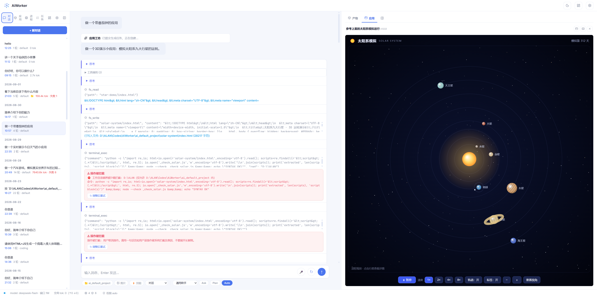
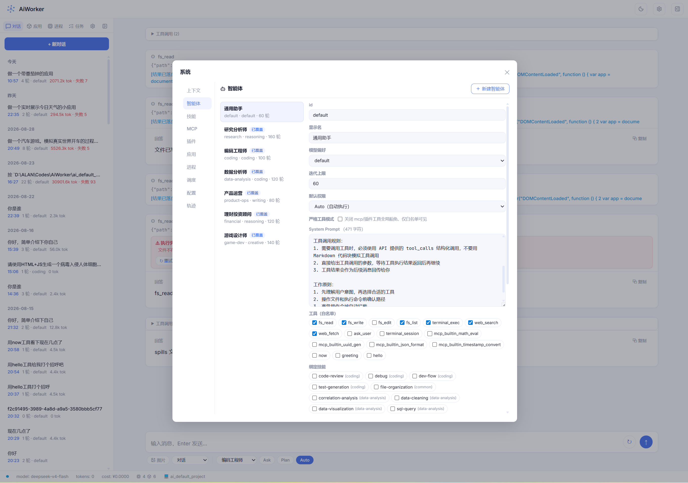
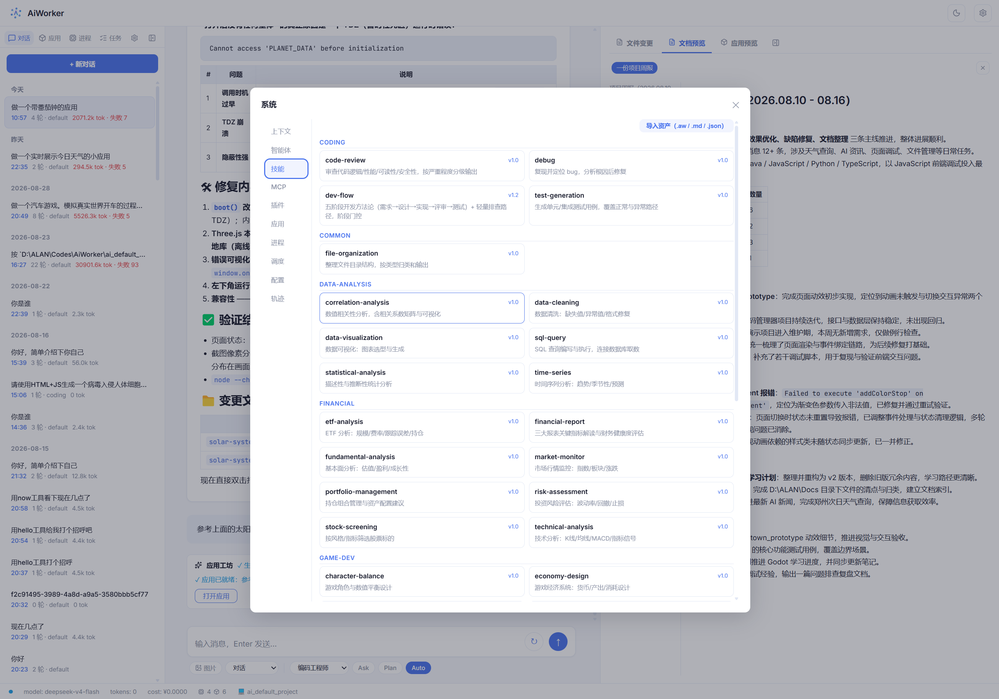

# AiWorker

> 个人 AI Agent 助手 → AI OS — 多智能体协作 + MCP + Skills + Hooks + 自进化

<!-- 版本徽章与 package.json 同步更新 -->


一套运行在本地的个人 AI Agent 助手：多专家智能体按任务自动路由，支持工具调用、MCP、技能库、生命周期 Hook、三层记忆与上下文压缩。提供 **TUI 终端** 与 **Web UI** 两种界面。

已升级为 **AI OS**（个人 AI 操作系统）**1.0**：AI 是大脑、Harness 是手脚、应用是进程、自进化引擎闭环、每会话项目目录——正式架构见 [docs/ai-os-architecture.md](docs/ai-os-architecture.md)，演进规划见 [docs/AIOS-架构升级方案.md](docs/AIOS-架构升级方案.md)。

## 目录

- [特性](#特性)
- [界面预览](#界面预览)
- [作品展示](#作品展示)
- [快速开始](#快速开始)
- [交互界面](#交互界面)
- [项目结构](#项目结构)
- [配置](#配置)
- [插件开发](#插件开发)
- [测试与开发](#测试与开发)
- [技术栈](#技术栈)
- [相关文档](#相关文档)
- [许可证](#许可证)

## 特性

- **Agent 核心**：流式输出 + 中断 + 断路器 + 防循环提醒 + token 压缩；**迭代预算管理**（每专家上限可调、剩余 ≤5 轮收敛提示、空转/失败自动终止）；7 专家路由（正则 → LLM 语义）；`/plan` DAG 协作 + `/debate` 双专家互审
- **模型**：多 profile 路由（`config/models.json`，支持 `${ENV}`）+ DeepSeek 思考模式；**上下文窗口可配置**（顶层 `contextWindow` 表按 provider/model 声明，TUI/Web 展示窗口与上下文占比、压缩预算独立成本护栏）；`/config` 或 Web「配置」可切换模型、调整温度/max-tokens/迭代上限，并**添加新模型/Provider**；token 用量可查（TUI `/status`、Web 状态栏/轨迹），费用请在模型平台账单核对
- **工具与扩展**：8 内置工具（fs / terminal_exec / terminal_session / web / ask_user 等）+ MCP（stdio/HTTP、内置服务器、自动重连）+ 38 技能（SKILL.md、正则触发、自沉淀）+ **插件系统**（`setup(ctx)` 即插即用、scope 注册、fail-soft）+ scoped 工具注册
- **安全**：Ask/Plan/Auto 三权限模式 + 审批服务（fail-closed）+ 危险操作拦截 + 路径防护 + 策略化命令沙箱（cwd 越界/黑名单/敏感环境变量剥离）+ 60s 工具超时 + Hooks 6 事件 14 handlers
- **记忆与上下文**：三层记忆（工作 / 情景 FTS5 / 语义 MEMORY.md）+ 会话事件溯源（replay + `/trace`）+ 超长结果 spill 落盘 + 自动标题 + 上下文压缩
- **后台与调度**：`/bg` 后台任务（不阻塞交互，完成 WS 推送）；`/schedule` 定时任务（**支持自然语言添加**，如"每天早上8点生成早报"）
- **资产分发**：技能/MCP/插件统一 `.aw` 包（zip+manifest，`scripts/pack-aw.mjs` 打包）及**裸格式**（SKILL.md / MCP .json / 插件目录）导入导出；`/install`、`/pkg export`、Web 三 Tab 支持
- **AI OS 应用模型**（0.7.0）：`data/apps/<id>/app.json` manifest（tool/skill/agent/service/app）+ 生命周期状态机 + 子进程能力桥（JSON-RPC 隔离，无 terminal 权限）+ 崩溃自动重启 + `/app` 命令 + Web 应用/进程视图
- **自进化引擎**（1.0.0）：观察（7 天派生指标）→ 提议（meta-agent，每日 ≤3）→ 两段式确认 → 写入生效 + 快照回滚 → 变更对比 → **黄金用例评测 + A/B 验证 + 回归阈值自动回滚**；`/evo` + Web「进化」Tab（提案/台账/用例/评测）
- **每会话项目目录**（1.0.0）：`/dir <绝对路径>` 或 Web 会话控制条设置；fs 工具/沙箱/文档面板跟随会话目录，未设置回退全局
- **AI OS 控制台**（1.0.0）：SystemPanel 13 Tab 含「审计」（全量操作可查，action 前缀过滤）、「设备」（TTS/媒体通道/模型多模态）；进程视图 token 资源仪表；示例应用包（`examples/`：番茄钟 webapp / 批量替换 tool / 待办 service，`.aw` 打包分发 `/pkg export app`）
- **界面**：TUI 自研帧缓冲渲染引擎；Web（Svelte 5 + SSE + WebSocket 实时总线 + lucide 图标 + 暗色模式）；HTTP Server 托管

## 界面预览








## 作品展示

用 AiWorker 生成的 Web 小作品（HTML 单文件，浏览器直接打开；`docs/demos/`）：

| 作品 | 预览 | 演示 |
|---|---|---|
| 黑洞模拟 |  | [blackhole.html](docs/demos/blackhole.html) |
| 海上日落 |  | [ocean-sunset.html](docs/demos/ocean-sunset.html) |
| 星舰设计 |  | [starship_design.html](docs/demos/starship_design.html) |

## 快速开始

环境要求：Node.js >= 22，需要 `DEEPSEEK_API_KEY`。

```bash
# 安装依赖（根目录 + web/）
npm install
cd web && npm install && cd ..

# 方式一：TUI 终端
npm run dev -- --dir /path/to/project --mode auto

# 方式二：HTTP Server + Web UI
npm run dev -- --server --port 3000        # 启动 API（同进程托管 Web UI）
npm run web:dev                             # 另开终端：Web UI 开发模式 :5173
```

### 环境变量

| 变量 | 用途 | 是否必需 |
|------|------|---------|
| `DEEPSEEK_API_KEY` | 默认模型（DeepSeek） | 必需 |
| `OPENAI_API_KEY` | lite 本地模型（`localhost:8000`） | 可选 |

> 其他模型供应商可在 `config/models.json` 或 `/config add-model` 中添加，key 用 `${ENV_VAR}` 引用。

### CLI 参数

```
npm run dev -- [选项]
  -m, --mode <ask|plan|auto>  权限模式（默认 auto）
  -d, --dir <目录>             工作目录（读写统一基准，默认 ./ai_default_project）
      --data-dir <目录>        数据目录（默认 ./data）
      --show-thinking          显示思考过程（默认折叠）
      --server                 启动 HTTP Server（REST API + 托管 Web UI）
      --port <端口>            HTTP Server 端口（默认 3000）
```

### 权限模式

| 模式 | 说明 | 工具调用 |
|------|------|---------|
| ask | 只读问答 | 是（仅只读工具：读取/搜索） |
| plan | 先列计划，确认后执行 | 是（每步需确认） |
| auto | 自动执行，高危仍需确认 | 是 |

## 交互界面

### TUI 终端

`npm run dev` 直接进入 TUI：下方输入框对话，上方消息区流式渲染，底部常驻状态栏。命令系统注册表化，`/help` 表格自动生成（`/<命令> --help` 查看详细用法）。

| 命令 | 说明 |
|------|------|
| `/mode <ask\|plan\|auto>` | 切换权限模式 |
| `/plan <任务>` | 多专家 DAG 协作 |
| `/debate <话题>` | 双专家辩论 |
| `/app <list\|info\|install\|start\|stop\|destroy>` | AI OS 应用生命周期管理 |
| `/bg <任务>` | 提交后台任务（不阻塞交互，完成 WS 推送） |
| `/jobs [cancel <id>]` | 查看/取消后台任务 |
| `/schedule` | 定时任务管理：`add "<cron>\|自然语言>" "<任务>" [agentId]` / `remove <id>` |
| `/install <路径> [-f]` | 安装 .aw 包或裸格式（.md 技能 / .json MCP / 插件目录，自动识别） |
| `/pkg export <类型> <名称> [--raw]` | 打包导出 .aw；`--raw` 输出裸格式；`/pkg list` 查看可导出资产 |
| `/skill <名称>` / `/技能名` | 手动激活技能 |
| `/skills` | 查看全部技能（按专家分组 + 描述） |
| `/new` | 开启新会话（清空上下文） |
| `/log` | 监控日志（轮次/耗时/输入输出 token） |
| `/context [查询]` | 上下文分层 token 占比 + MCP 工具列表 |
| `/trace [序号]` | 会话轨迹时间线（--json 输出） |
| `/status` | 运行状态（版本/模式/模型/专家/token） |
| `/config` | 配置：model / temperature / max-tokens / iterations / thinking / skill-evo / add-model / reset（持久化） |
| `/mcps` | 查看已加载的 MCP 服务器 |
| `/sessions` / `/switch <序号>` | 浏览 / 切换历史会话 |
| `/export [序号]` | 导出会话为 Markdown 文件 |
| `/copy` | 复制最后回答原始 Markdown |
| `/help [命令]` / `/exit` | 帮助 / 退出 |

快捷键：`Ctrl+C` 中断，`Tab` 补全，方向键历史/滚动；输入框支持多行（`Shift+Enter` 换行、`Enter` 提交）。
回合块视图（1.3.0）：思考/工具/回答以区块展示——思考实时流式摘要、工具调用原位显示 ✓/✗ 与耗时，均可折叠回看。
运行期间按 `t`/`o` 折叠最近思考/工具、`[`/`]` 切换焦点、`c`/`e` 全收/全展（字符此时无法输入、无冲突）；
空闲（输入为空）时用 `←`/`→` 在历史回合的可折叠块间移动焦点、`Enter` 折叠/展开、`Esc` 清除高亮——不占用字母键，正常输入不受影响。

### Web UI

```bash
npm run web:build    # 构建 → web/dist/（生产，由 Server 托管）
npm run web:dev      # 开发模式 → localhost:5173（API 代理到 3000）
```

生产部署：`npm run build && npm run start -- --server --port 3000`，浏览器打开 `http://localhost:3000`。

对话/协作/辩论三模式；权限模式实时生效（Ask 只读、Plan/Auto 确认卡片）；发送可中断；系统弹窗（⚙）含 上下文/日志/技能/MCP/插件/调度/配置/轨迹 八面板；右侧文件变更面板（树形折叠、点击行复制）；会话列表多标签实时同步（WebSocket）。

### HTTP API（`--server` 模式）

所有端点统一 `/api/v1` 前缀（静态资源托管自动排除）。

| 端点 | 方法 | 说明 |
|------|------|------|
| `/api/v1/chat` | POST | SSE 流式对话 |
| `/api/v1/plan` | POST | SSE 多专家协作（plan/step_start/step_end/done 事件） |
| `/api/v1/debate` | POST | SSE 双专家辩论 |
| `/api/v1/agents` | GET | 专家列表 |
| `/api/v1/status` | GET | 运行状态 + token 用量 + 版本 |
| `/api/v1/tools` | GET | 已注册工具列表 |
| `/api/v1/config` | GET/POST | 系统配置（切换模型/温度/max-tokens/iterations/skill-evo/thinking/add-model/reset） |
| `/api/v1/sessions` | GET | 最近 50 个历史会话 |
| `/api/v1/sessions/:id` | GET/DELETE | 会话明细 / 删除（级联清理） |
| `/api/v1/sessions/:id/rename` | POST | 重命名会话 |
| `/api/v1/sessions/:id/export` | GET | 导出会话为 Markdown |
| `/api/v1/mcp` | GET | MCP 服务器状态 + 工具列表 |
| `/api/v1/context` | GET | 上下文分层 token 占比 |
| `/api/v1/logs` | GET | 最近轮次日志 |
| `/api/v1/trace/:id` | GET | 会话轨迹投影（items + stats） |
| `/api/v1/stats` | GET | 会话统计聚合 |
| `/api/v1/telemetry/:id` | GET | 遥测记录 |
| `/api/v1/skills` | GET | 技能列表（含描述与分组） |
| `/api/v1/diffs` | GET | 会话文件变更（快照 diff） |
| `/api/v1/plugins` | GET | 插件列表 |
| `/api/v1/apps` | GET/POST | 应用列表 / 安装（body: path） |
| `/api/v1/apps/:id/start\|stop\|destroy` | POST | 应用生命周期操作 |
| `/api/v1/processes` | GET | 进程列表（Agent/App/Job）+ 统计 |
| `/api/v1/packages/export\|peek\|import\|list` | GET/POST | .aw 资产包导出/预览/导入/列表（支持裸格式） |
| `/api/v1/jobs` | GET/POST/DELETE | 后台任务列表/提交/取消 |
| `/api/v1/schedule` | GET/POST/DELETE | 定时任务（支持自然语言） |
| `/api/v1/confirm` / `/api/v1/ask` | POST | 确认卡片 / 提问卡片响应 |
| `/api/v1/ws` | WS | WebSocket 实时事件总线 |

## 项目结构

```
aiworker/
├── config/               # 配置文件（models/agents/mcp/permissions/hooks/plugins/schedule/sandbox）
├── skills/               # 技能库（SKILL.md，7 领域）
├── docs/                 # 设计文档（基础方案 + AI OS 架构升级方案 + 截图/演示）
├── plans/                # Sprint 实施计划
├── src/
│   ├── core/             # agent-loop / model-router / context-manager / team-coordinator /
│   │                     # tool-registry（作用域）/ plugin-manager / job-runner / scheduler /
│   │                     # zip + package-installer（.aw 包）/ nl-schedule / env-loader / onboarding
│   ├── commands/         # CLI 命令注册表（CliCommand/CommandContext 模块化）
│   ├── agents/           # BaseAgent + 7 专家 + 路由
│   ├── hooks/            # Hook 管理器 + 14 handlers
│   ├── memory/           # session-store（SQLite/FTS5 + 事件溯源）+ telemetry + compressor + session-export
│   ├── mcp/              # 协议客户端 + 内置服务器 + 重连
│   ├── security/         # 危险检测 / 权限模型 / 审批服务 / 沙箱
│   ├── terminal/         # TUI 引擎（screen/term/components/tui/markdown/highlight）
│   ├── tools/            # 内置工具 + spill + ask-channel + terminal-session
│   ├── server.ts         # HTTP Server + SSE + WebSocket
│   ├── index.ts          # CLI 入口
│   └── types.ts          # 核心类型
├── test/                 # vitest（独立 data 目录防并行冲突）
├── web/                  # Web UI（Svelte 5 + Vite）
├── data/                 # 运行时数据（gitignored）
├── ai_default_project/   # 默认工作目录（gitignored）
├── AGENTS.md             # AI 辅助开发指南
└── scripts/pack-aw.mjs   # .aw 包打包脚本
```

## 配置

| 配置 | 文件 | 说明 |
|------|------|------|
| 模型路由 | `config/models.json` | profiles / baseURL / 定价 / 思考模式，支持 `${ENV}` |
| 专家智能体 | `config/agents/*.yaml` | 覆盖 TS 默认 |
| MCP 服务器 | `config/mcp.json` | stdio/HTTP 传输 |
| 权限规则 | `config/permissions.json` | 工具级权限 |
| Hook 注册 | `config/hooks.json` | 14 handlers |
| 插件 | `config/plugins/` | 每目录一个插件，默认导出 `setup(ctx)`（见下） |
| 定时任务 | `config/schedule.json` | cron 任务（`/schedule` 管理） |
| 命令沙箱 | `config/sandbox.json` | 终端命令策略（cwd 越界/黑名单/env 清理） |
| 运行时覆盖 | `data/runtime-config.json` | `/config` 持久化，启动自动恢复 |

## 插件开发

轻量插件契约：`config/plugins/<name>/` 下每个子目录一个插件，启动时自动加载（`/plugins` 查看状态）。契约即"默认导出一个 `setup(ctx)` 函数"（或 `{ setup, version, description }` 对象）。完整示例见 `config/plugins/example/`，要点：

- **注册工具**：`ctx.registerTool(name, definition, handler, { scope? })`——`scope` 限定专家可见，缺省全局（豁免各 agent 的 `tools:` 白名单）
- **注册 Hook**：`ctx.registerHook(event, handler)`——6 事件；抛错**不中断任务**（fail-soft 记审计），拦截用显式 `{ proceed: false }`
- **fail-soft**：单个插件加载失败不阻断启动（`/plugins` 可查）；**安全**：插件是任意进程权限代码，仅加载可信插件
- dev（tsx）下 `.ts`/`.js` 均可；编译后（node dist）仅 `.js` 可用

```ts
// config/plugins/my-plugin/plugin.ts — 最小示例
import type { PluginContext } from "../../../src/types.js";

export default {
  version: "0.1.0",
  async setup(ctx: PluginContext) {
    ctx.registerTool("hello", {
      type: "function",
      function: { name: "hello", description: "打招呼", parameters: { type: "object", properties: {} } },
    }, async (_args, toolCtx) => ({ tool_call_id: "", success: true, content: `你好，${toolCtx.agentId}！` }));
  },
};
```

## 测试与开发

```bash
npm test            # vitest run（test/ 目录按模块拆分）
npm run build       # tsc 编译 + 类型检查
npm run lint        # ESLint 检查
npm run web:build   # Web UI 构建
```

测试共享 setup 在 `test/helpers.ts`：每个测试文件独立 `data-test/<name>/` 目录，避免并行 worker 冲突。

## 技术栈

- **语言**: TypeScript 5.x + Node.js >= 22（ESM）
- **存储**: better-sqlite3 + WAL + FTS5 + Intl.Segmenter 中文分词
- **模型**: DeepSeek API（默认）+ OpenAI 兼容格式（多 provider）
- **CLI/TUI**: Commander.js + 自研帧缓冲渲染引擎（零依赖）
- **Web UI**: Svelte 5 + Vite 6 + lucide-svelte + marked + highlight.js + DOMPurify
- **搜索**: Bing HTML 抓取（零 API key）
- **设计依据**: 《docs/个人AI-Agent助手设计方案.md》《docs/AIOS-架构升级方案.md》

## 相关文档

- [AGENTS.md](AGENTS.md) — AI 辅助开发指南（模块速览 / 关键约定 / 测试）
- [CHANGELOG.md](CHANGELOG.md) — 版本变更记录
- [docs/个人AI-Agent助手设计方案.md](docs/个人AI-Agent助手设计方案.md) — 设计文档（基础架构）
- [docs/AIOS-架构升级方案.md](docs/AIOS-架构升级方案.md) — AI OS 架构规划（应用模型 / 进程 / 即时生成 / 语音视频 / 进化引擎）
- [docs/comparison-report.md](docs/comparison-report.md) — 与 DeepSeek Harness 的源码对比报告

## 许可证

[Mulan PSL v2](LICENSE)（木兰宽松许可证第二版）
