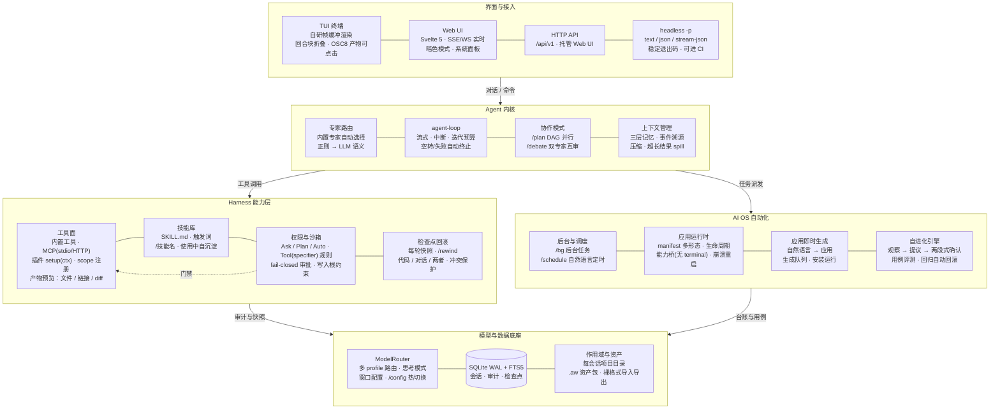

# AiWorker

> 个人 AI Agent 助手 → AI OS — 多智能体协作 + MCP + Skills + Hooks + 自进化

<!-- 版本徽章与 package.json 同步更新 -->


一套运行在本地的个人 AI Agent 助手：多专家智能体按任务自动路由，支持工具调用、MCP、技能库、生命周期 Hook、三层记忆与上下文压缩。提供 **TUI 终端** 与 **Web UI** 两种界面。

已升级为 **AI OS**（个人 AI 操作系统）**1.0**：AI 是大脑、Harness 是手脚、应用是进程、自进化引擎闭环、每会话项目目录——正式架构见 [docs/ai-os-architecture.md](docs/ai-os-architecture.md)，演进规划见 [docs/AIOS-架构升级方案.md](docs/AIOS-架构升级方案.md)。

## 目录

- [系统总览](#系统总览)
- [界面预览](#界面预览)
- [作品展示](#作品展示)
- [快速开始](#快速开始)
- [交互界面](#交互界面)
- [项目结构](#项目结构)
- [配置](#配置)
- [插件开发](#插件开发)
- [测试与开发](#测试与开发)
- [技术栈](#技术栈)
- [相关文档](#相关文档)
- [许可证](#许可证)

## 系统总览

> 一张图看完能力地图：界面接入 → Agent 内核调度 → Harness 能力（工具 / 技能 / 权限 / 回滚）→ AI OS 自动化与自进化。



## 界面预览


## 作品展示

用 AiWorker 生成的 Web 小作品（HTML 单文件，浏览器直接打开；`docs/demos/`）：

| 作品 | 预览 | 演示 |
|---|---|---|
| 黑洞模拟 |  | [blackhole.html](docs/demos/blackhole.html) |
| 海上日落 |  | [ocean-sunset.html](docs/demos/ocean-sunset.html) |
| 星舰设计 |  | [starship_design.html](docs/demos/starship_design.html) |

## 快速开始

环境要求：Node.js >= 22，需要 `DEEPSEEK_API_KEY`。

```bash
# 安装依赖（根目录 + web/）
npm install
cd web && npm install && cd ..

# 方式一：TUI 终端
npm run dev -- --dir /path/to/project --mode auto

# 方式二：HTTP Server + Web UI
npm run dev -- --server --port 3000        # 启动 API（同进程托管 Web UI）
npm run web:dev                             # 另开终端：Web UI 开发模式 :5173
```

### 环境变量

| 变量 | 用途 | 是否必需 |
|------|------|---------|
| `DEEPSEEK_API_KEY` | 默认模型（DeepSeek） | 必需 |
| `OPENAI_API_KEY` | lite 本地模型（`localhost:8000`） | 可选 |

> 其他模型供应商可在 `config/models.json` 或 `/config add-model` 中添加，key 用 `${ENV_VAR}` 引用。

### CLI 参数

```
npm run dev -- [选项]
  -m, --mode <ask|plan|auto>  权限模式（默认 auto）
  -d, --dir <目录>             工作目录（读写统一基准，默认 ./ai_default_project）
      --data-dir <目录>        数据目录（默认 ./data）
      --show-thinking          显示思考过程（默认折叠）
      --server                 启动 HTTP Server（REST API + 托管 Web UI）
      --port <端口>            HTTP Server 端口（默认 3000）

headless 一次性运行（1.6.0，可被脚本/CI 编排）：
  -p, --print <提示词>         执行后退出，不进入交互模式（与 --server 互斥）
      --output-format <格式>   text（默认，只输出回答）| json（单个结果对象）| stream-json（NDJSON 事件流）
      --session <id>           续接既有会话（缺省新建）
      --agent <id>             直接指定智能体（缺省按提示词路由）
      --yes                    本次运行放行需确认的工具（进程内开关，不落盘；不覆盖 deny 规则、never_auto_approve 与受保护路径）
      --max-iterations <n>     覆盖本次运行的迭代上限
```

```bash
# 结构化输出，stdout 只有一行 JSON（日志与告警走 stderr）
npm run dev -- -p "总结 reports/季度复盘.md 的三个结论" --output-format json --mode auto | jq .

# 事件流：system / thinking / text / tool_call / tool_result / result / confirm_denied
npm run dev -- -p "把 a.md 里的 TODO 清掉" --output-format stream-json --yes

# 续接会话继续追问
npm run dev -- -p "接着上面的结论，给出下一步计划" --session <sessionId>
```

**退出码**：`0` 成功 / `1` 运行失败（含模型连接失败） / `2` 参数错误 / `3` 权限拒绝（fail-closed） /
`4` 达到迭代上限 / `130` 中断（Ctrl+C）。

headless 的执行语义：不初始化 TUI、不打印 banner 与状态区、不启动定时调度器；**没有确认通道**，
需要确认的工具一律 fail-closed 拒绝（结构化输出 `confirm_denied`），`ask_user` 直接失败而不是挂起等待输入。

### 权限模式

| 模式 | 说明 | 工具调用 | 适用场景 |
|------|------|---------|---------|
| ask | 只读问答 | 仅只读工具（读取/搜索） | 只想问、不想被改文件 |
| plan | 先列计划，确认后执行 | 每步需确认 | 重要改动前先过一遍 |
| auto | 自动执行，高危仍需确认 | 全部，高危/受保护路径需确认 | 日常使用 |

#### 权限规则（`config/permissions.json`）

模式之上可叠加 `Tool(specifier)` 级规则，求值顺序 **deny > ask > allow**：

```json
{
  "rules": [
    { "tool": "terminal_exec", "match": "*git push --force*", "action": "deny" },
    { "tool": "fs_write", "match": "*secret*", "action": "ask" },
    { "tool": "terminal_exec", "match": "*npm test*", "action": "allow" }
  ],
  "never_auto_approve": ["fs_write"],
  "protected_paths": [".git", ".ssh", ".env", "id_rsa"]
}
```

| 字段 | 匹配对象 | 语义 |
|------|---------|------|
| `rules[].tool` | 工具名（glob） | `fs_*`、`mcp_*`、`*`，大小写不敏感 |
| `rules[].match` | 目标串（glob） | 缺省 = 该工具全命中；目标串见下表 |
| `rules[].action` | — | `deny` 任何模式直接拒绝；`ask` 强制确认（无确认通道即拒绝）；`allow` 仅 auto 免确认，不绕过只读模式，也不能覆盖下方 `never_auto_approve` 与 `protected_paths` |
| `never_auto_approve` | 工具名（glob） | 任何模式都必须确认，无通道即拒绝 |
| `protected_paths` | 路径段 | 命中即对**读与写**工具强制确认；按路径段匹配（`.git` 命中 `.git/config`，不命中 `.gitignore`/`.github/**`；`.env` 命中 `.env.local`） |

| 工具类别 | 目标串（`match` 的匹配对象） |
|---------|----------------------------|
| fs 类（`fs_read` / `fs_write` / `fs_edit` / `fs_list`） | 解析后的绝对路径 |
| `terminal_exec` / `terminal_session` | 命令文本 |
| 其余工具（含 MCP / 插件） | 参数 JSON（`JSON.stringify(args)`，键顺序敏感） |

| 约定 | 说明 |
|------|------|
| 求值优先级 | 命中多条规则时 `deny` > `ask` > `allow`；同类取配置中首条 |
| plan 模式 | 保持"全确认"语义，规则不改变它 |
| 规则写错 | `action` 拼写错误等在启动时告警并忽略，不会静默变成"没有规则" |

#### 权限记忆（`/permissions`）

规则分两级来源，确认弹窗里的「始终允许」与命令写入的是同一张表：

| 来源 | 存放位置 | 生命周期 | 撤销方式 |
|------|---------|---------|---------|
| 项目级 | `<--dir>/config/permissions.json` 的 `rules`（不存在时回落启动目录的同名文件；原子替换：临时文件 + `fsync` + `rename`，保留 BOM、行尾风格、权限位与其他字段） | 跨进程 | `/permissions revoke <序号>` 或删文件条目 |
| 会话级 | 进程内存 | 重启即失效 | `/permissions clear-session` |

| 用法 | 行为 |
|------|------|
| `/permissions` | 列出生效规则：动作 / 工具 / 目标 / **来源**（会话级在前、项目级在后，即规则表实际顺序） |
| `/permissions allow\|ask\|deny <Tool>[(<glob>)]` | 写入项目级规则（如 `/permissions allow terminal_exec(npm install)`） |
| `/permissions revoke <序号> [--project\|--session]` | 按列表序号撤销；来源限定不符时拒绝，而不是撤错 |
| `/permissions reset` / `clear-session` | 清空项目级 / 会话级规则（reset 清空整个 `rules` 数组，含无法识别的条目） |

| 约束 | 说明 |
|------|------|
| 确认弹窗的「始终允许」 | 只出现在 **auto 模式的高危确认**上（规则 `ask`、`never_auto_approve`、受保护路径按设计每次都问，不提供记忆）。选项固定为 `1 允许 / 2 拒绝 / 3 始终允许（写入项目配置） / 4 本会话始终允许`；生成的规则带 `exact: true`，按**字面精确匹配**（命令里的 `*` 不当通配），撤销后立即恢复询问 |
| allow 规则与危险检测 | 显式 allow 规则**不再短路危险检测**：`terminal_exec` / `terminal_session` / `fs_write` 的高危输入仍要确认，只有交互产生的 `exact` 规则与 `--yes`（进程内、不落盘）可豁免；`tool: "*"` 且无 `match` 的全局 allow 拒绝写入 |
| 撤销的语义 | 撤销 / 重置**先改内存再落盘**：即使配置文件损坏或缺失，规则在当前进程也立即失效，并以 warning 说明"重启后会重新生效" |
| 跨进程一致性 | 按文件 `mtime`/`size` 懒重载：CLI 或另一个进程改过规则后，运行中的 server 在下一次权限判定时生效；文件不可读时保留当前规则并告警（不静默丢 deny） |
| 保护清单兜底 | 配置缺失或损坏时，受保护路径回落到**内置清单**（`.git`/`.ssh`/`.env`/`id_rsa` 等），不会因为"读不到配置"而静默失去保护 |
| 审计归属 | 规则变更写审计并带 `agentId` / `sessionId`（确认弹窗触发的记在该会话上，CLI 记为用户操作），审计 Tab 可见 |
| 拒绝写入的情形 | 配置损坏（不是合法 JSON / 顶层非对象）→ 一律拒绝且不新建；格式非法、`never_auto_approve` 清单内工具写成 `allow`、`allow` 目标触及受保护路径（按路径段判定，`.gitignore` / `.github/*` 不误伤）、通配工具无目标 → 拒绝并回显原因，文件原样不动 |
| 首次写入 | 项目配置不存在时**按需创建**（以启动目录配置为模板，含受保护路径等基础策略）；`<--dir>/config/permissions.json` 若是别的工具的同名文件（不含权限键）则拒绝覆盖。因此启动目录/安装目录的配置不会被 Agent 授权动作改写 |
| fail-closed | 无确认通道（headless、后台任务）不会产生任何规则 |
| Web 端 | 右侧栏「权限」Tab：规则表 + 来源徽标 + warning 提示 + 新增/撤销/清空 |

写接口（`POST /api/v1/permissions`）有三道门：**跨站校验**（`Sec-Fetch-Site: cross-site`，或缺失时 `Origin` 与 `Host` 不一致 → 403）、**进程 token**（请求头 `X-AiWorker-Token`，启动日志与 `<dataDir>/server-token` 可查，缺/错 → 401）、参数校验（非法 `scope` → 400）。token 由服务端注入 `index.html`，该响应**不带** `Access-Control-Allow-Origin`，跨源页面读不到；`GET` 只读接口保持开放，与 `/audit`、`/status` 一致。其余既有写接口（`/config`、`/pkg/import` 等）沿用原有信任模型，未在本轮收紧。

#### 路径与命令边界

读根 / 写根由 `config/sandbox.json` 定义，**命令层与 fs 工具共用同一套判定**（`src/security/path-policy.ts`）：

| 维度 | 内容 |
|------|------|
| 读根 | `allowReadDirs`，留空回退工作目录；`fs_read` / `fs_list` 越界直接拒绝（拒绝原因是策略，不是"文件不存在"） |
| 写根 | `allowWriteDirs`，留空回退工作目录；`fs_write` / `fs_edit` 与命令层写入目标使用同一写根 |
| 符号链接 | 按**真实路径**判定：从盘根**逐组件**解析（每个存在的组件都 `realpath`，`..` 在解析之后才弹出，与内核"先跟随链接再弹一层"一致），链接指向根外会被拦截 |
| 解析失败 | 悬空符号链接、链接环、权限不足、组件数超限 → **一律拒绝**（fail-closed，不退化成词法判定），提示"路径无法解析为真实路径" |
| 开关语义 | 路径边界**始终生效**；`sandbox.enabled: false` 只关闭命令层约束，不会静默关掉文件读写边界 |
| 空路径 | 空 / 纯空白 / 非字符串入参 → 拒绝 |
| 保留设备名 | Windows 下 `NUL` / `CON` / `COM1` 等保留设备名与 NTFS 备用数据流（`a.txt:stream`）→ 拒绝，不再"写入成功但内容被丢弃" |
| 配置位置 | 与权限配置同样**跟随 `--dir`**：优先 `<--dir>/config/sandbox.json`，其次启动目录，最后回落到包内 `config/sandbox.json`；目录下的同名文件若不含任何沙箱键则忽略 |

`config/sandbox.json` 的命令层约束（**策略级**防线，非 OS 级隔离；配置位置同样跟随 `--dir`）：

| 维度 | 内容 |
|------|------|
| 生效约束 | 工作目录越界拒绝（fail-closed）· 命令黑名单 · 敏感环境变量剥离 · **`allowWriteDirs` 写入根约束** |
| 覆盖范围 | `terminal_exec` / `terminal_session` 的重定向（`>` / `>>`，非包裹命令做引号感知，引号内的 `>` 不算重定向）与写入类命令/程序的**所有像路径参数**（源与目标都查） |
| 已列举的写入形态 | `Set-Content` / `Out-File` / `del` / `copy` / `mkdir`；PowerShell 别名 `rm` / `ri` / `ni` / `sc` / `cp` / `mv`；`curl -o` / `Invoke-WebRequest -OutFile` / `robocopy` / `xcopy` / `tar -C` / `Expand-Archive` / `git clone` / `npm install --prefix` |
| 无法静态解析的目标 | 含变量 / 通配 / 主目录（`$`、`%`、`~`）→ 直接拒绝，提示改用 `fs_write` |
| 相对路径与 `..` | 按命令**原文**逐组件解析（`link\..\x` 先跟随 `link` 再弹一层），不做词法折叠 |
| **不覆盖**（诚实说明） | 解释器脚本体内部的写入（`python -c`、`node -e`、脚本文件）· 未列举的第三方程序 · 管道下游程序的写入 · `cd` 之后相对路径的真实归属（`terminal_session` 按会话工作目录判定）· 命令位置之外的写入（如 `cmd /c del x` 的子命令参数）· 未被 `looksLikePath` 识别为路径的 token · MCP 工具与插件工具的文件写入 |
| 定位 | 与 danger-detector、路径校验、工具超时、输出截断共同构成多层防御，**不是沙箱替代品** |

#### 检查点与回滚

| 用法 | 行为 |
|------|------|
| `/rewind` | 列出本会话检查点（轮次 / 时间 / 输入摘要 / 文件数 / 可恢复数） |
| `/rewind <n>` | 先打印预览，再交互三选：**代码+对话** / **仅对话** / **仅代码**（无通道则取消，fail-closed） |
| `/rewind <n> --code --dry-run` | 只预览将还原/删除/跳过/冲突的文件与将移除的消息数，不改动任何东西 |
| `/rewind <n> --all --force` | 覆盖"有外部改动"的冲突文件（默认跳过冲突文件） |

| 维度 | 说明 |
|------|------|
| 快照时机与位置 | 每轮对话开始时建检查点（`<data>/checkpoints/<sessionId>/turn-<n>/`）；写文件前先落盘**变更前内容** |
| 对话回滚 | 走事件溯源：不删历史事件，追加 `rewind/applied` 标记，消息视图与后续上下文按标记截断（`/trace` 仍可回看） |
| 冲突保护 | 恢复前比对当前内容与记录的"变更后哈希"，不一致（手改 / 被 `terminal_exec` 改过）默认拒绝覆盖 |
| 保留策略 | 每会话最近 20 轮，`AIWORKER_CHECKPOINT_KEEP` 可覆盖 |
| 边界（诚实说明） | 仅 `fs_write` / `fs_edit` 可精确回滚；`terminal_exec` 等改动只记录条目（`restorable: false`），回滚时列入"跳过"；单文件 > 2MB 或二进制不入快照；回滚是**文件级整体还原**，不能只撤销部分行 |
| Web 端 | 右侧栏「回滚」Tab 提供同一能力（需重启后端以加载新端点） |


## 交互界面

### TUI 终端

`npm run dev` 直接进入 TUI：下方输入框对话，上方消息区流式渲染，底部常驻状态栏。命令系统注册表化，`/help` 表格自动生成（`/<命令> --help` 查看详细用法）。

| 命令 | 说明 |
|------|------|
| `/mode <ask\|plan\|auto>` | 切换权限模式 |
| `/plan <任务>` | 多专家 DAG 协作 |
| `/debate <话题>` | 双专家辩论 |
| `/app <list\|info\|install\|start\|stop\|destroy>` | AI OS 应用生命周期管理 |
| `/bg <任务>` | 提交后台任务（不阻塞交互，完成 WS 推送） |
| `/jobs [cancel <id>]` | 查看/取消后台任务 |
| `/schedule` | 定时任务管理：`add "<cron>\|自然语言>" "<任务>" [agentId]` / `remove <id>` |
| `/install <路径> [-f]` | 安装 .aw 包或裸格式（.md 技能 / .json MCP / 插件目录，自动识别） |
| `/pkg export <类型> <名称> [--raw]` | 打包导出 .aw；`--raw` 输出裸格式；`/pkg list` 查看可导出资产 |
| `/skill <名称>` / `/技能名` | 手动激活技能 |
| `/skills` | 查看全部技能（按专家分组 + 描述） |
| `/new` | 开启新会话（清空上下文） |
| `/log` | 监控日志（轮次/耗时/输入输出 token） |
| `/rewind [轮次] [--code\|--chat\|--all] [--dry-run] [--force]` | 检查点回滚：无参数列出回合，带轮次交互三选（代码+对话/仅对话/仅代码），先预览再执行 |
| `/permissions [allow\|ask\|deny <Tool>[(<glob>)] \| revoke <序号> \| reset \| clear-session]` | 权限规则：列出（含来源）/ 写项目级规则 / 撤销 / 清空项目级或会话级 |
| `/context [查询]` | 上下文分层 token 占比 + MCP 工具列表 |
| `/trace [序号]` | 会话轨迹时间线（--json 输出） |
| `/status` | 运行状态（版本/模式/模型/专家/token） |
| `/config` | 配置：model / temperature / max-tokens / iterations / thinking / skill-evo / add-model / reset（持久化） |
| `/mcps` | 查看已加载的 MCP 服务器 |
| `/sessions` / `/switch <序号>` | 浏览 / 切换历史会话 |
| `/export [序号]` | 导出会话为 Markdown 文件 |
| `/copy` | 复制最后回答原始 Markdown |
| `/help [命令]` / `/exit` | 帮助 / 退出 |

#### 快捷键

| 按键 | 作用 | 生效时机 |
|------|------|---------|
| `Enter` | 提交输入（输入为空时不提交） | 输入中 |
| `Shift+Enter` / `Alt+Enter` / `Ctrl+Enter` | 换行（多行输入） | 输入中 |
| `Tab` | 补全命令 / 技能名（多候选时显示提示行） | 输入中 |
| `↑` / `↓` | 多行输入 → 移动光标行；有内容 → 翻历史；输入为空 → 滚动消息区 | 输入中 |
| `←` / `→` / `Home` / `End` | 光标左右移动 / 行首行尾 | 输入中 |
| `PgUp` / `PgDn`（滚轮同理） | 消息区翻页（10 行）/ 滚动（3 行） | 任意 |
| `t` / `o` | 折叠·展开 最近思考 / 工具详情 | 回合运行中 |
| `[` / `]` | 在思考·工具块之间移动焦点 | 回合运行中 |
| `c` / `e` | 全部折叠 / 全部展开 | 回合运行中 |
| `←` / `→` | 在历史回合的可折叠块之间移动焦点 | 输入为空且有可折叠块 |
| `Enter` | 折叠 / 展开焦点块（无焦点时取最近的思考块） | 同上 |
| `Esc` | 清除焦点高亮 | 同上 |
| `Ctrl+C` | 运行中：中断当前回合；空闲：退出 | 全局 |
| `Ctrl+D` | 退出 | 空闲 |

> 空闲态的 `←` / `→` / `Enter` / `Esc` 仅在输入为空时生效，不占用字母键位；输入任意字符即自动清除高亮。

#### 回合块视图

| 区块 | 展示 | 交互 |
|------|------|------|
| 思考 | 流式摘要（`--show-thinking` 时展开全文） | `t` 折叠 / 展开 |
| 工具调用 | 原位显示 ✓/✗、耗时与参数摘要 | `o` 折叠 / 展开详情 |
| 回答 | 流式 Markdown + 产物 chips | — |

#### 工具产物预览

| 产物 | TUI | Web |
|------|-----|-----|
| 📄 文件 | chip（含大小），终端支持 OSC 8 时可直接点击打开 | 点击 chip 打开预览窗口（Markdown / 代码 / 图片 / 视频 / 音频 / PDF / Office / diff），可全屏、可拖拽调整大小 |
| 🔗 链接 | chip（站点 + 标题） | 可点击，链接产物同样进预览窗口 |
| 📝 变更 | chip（`+/-` 行数） | diff 着色预览 |

### Web UI

```bash
npm run web:build    # 构建 → web/dist/（生产，由 Server 托管）
npm run web:dev      # 开发模式 → localhost:5173（API 代理到 3000）
```

生产部署：`npm run build && npm run start -- --server --port 3000`，浏览器打开 `http://localhost:3000`。

| 维度 | 内容 |
|------|------|
| 对话模式 | 对话 / 多专家协作 / 双专家辩论（顶部切换） |
| 权限联动 | 权限模式实时生效：Ask 只读；Plan / Auto 走确认卡片 |
| 流式与中断 | 流式输出，发送后可随时中断 |
| 系统面板（⚙） | 上下文 / 日志 / 技能 / MCP / 插件 / 调度 / 轨迹 / 审计 / 设备 / 进化 |
| 右侧栏 | 产物（文件改动 + 文档 + 图片/媒体/链接 + 检查点时间线）/ 权限 / 应用 三个 Tab |
| 多标签同步 | 会话列表跨标签页实时同步（WebSocket） |

### 设备面板（动态探测）

**设置（⚙）→ 设备**里每一项都是**实时探测**结果，不是写死的清单：

| 卡片 | 探测方式 |
|------|----------|
| 语音输入（ASR）/ 语音输出（TTS） | 逐个校验模型文件（缺哪个列哪个）+ provider 解析（sherpa 本地就绪优先，否则 edge-tts 在线降级） |
| 媒体服务器 | WS 音频通道实际状态与连接数 |
| 模型能力 | 图片能力按「**实测 → 配置声明 → 未声明**」三级判定。点【检测图片能力】会真实发一次 1×1 PNG 请求（约几十 token）验证端点是否接受图片；结论按**模型名**缓存到 `<dataDir>/device-probe.json`，换模型自动失效（面板标"此结果失效"）。未实测且 `config/models.json` 的当前 profile 未声明 `vision` 时，图片提问会被明确拒绝并提示如何检测 |
| 运行时 | Node / 平台 / 架构 / CPU / 内存 / PID / 运行时长、数据目录可写性（真实写文件探测，非 `accessSync`） |
| 存储（记忆库） | 真实建库并验证 SQLite 版本与 FTS5 可用性 + 记忆库路径与体积 |

模型能力判定与 `/api/v1/chat` 的图片输入**同源**：实测通过后即可发送图片，不必改配置；`vision:true` 只是省掉一次实测的声明。

### 产物工作台（右侧栏「产物」）

一次会话**产出了什么**集中在一处，不必在三个 Tab 之间找同一个文件：

| 区域 | 内容 |
|------|------|
| 顶部分组/过滤 | 按类型（文档/代码/图片/媒体/链接）· 按目录 · 按回合 三种分组；范围可切「本会话 / 所有会话」；路径搜索 |
| 左侧列表 | 每个产物带 `新增/修改/删除`、`+n −n`、回合号、大小与**来源徽标**（工具产物 / 文件系统快照 / 文档索引 / 回合检查点）；**左列表与右详情的分界可拖拽调宽**（双击或 `Home` 复位，`←/→` 微调，宽度记忆在本地） |
| 右侧查看器 | `.md` 复用文档渲染；文本/代码原文；图片内联；diff 行级高亮；链接卡；视频/音频/PDF/Office 走独立预览窗口（含 Office 前端转换） |
| 动作 | 打开预览 / 下载 / 复制路径 / 在对话中查看（滚到产生它的工具卡片并**持久高亮**；同一产物命中多处时可 ↑更早 / ↓更近 逐处走查，`Esc` 或「清除高亮」结束定位） |
| 底部时间线 | 检查点按回合排列；点选 → **高亮**该回合产物（不隐藏其他）；`回滚代码` / `回滚代码 + 对话` 均先出 `dry-run` 预览再二次确认 |

**诚实标注**：来源为「文件系统快照」的改动可能不是本会话 Agent 写的（工作目录快照的语义如此）；老会话（Sprint 45 之前）事件里没有产物字段，面板会明确提示"仅显示文件改动与文档"，不假装没有产出。

「仅对话回滚」不在产物面板：它是聊天语义，放在**对话流里用户消息的「从这里重新开始」**（hover 显示，先 `dry-run` 再确认）。

### HTTP API（`--server` 模式）

所有端点统一 `/api/v1` 前缀（静态资源托管自动排除）。

| 端点 | 方法 | 说明 |
|------|------|------|
| `/api/v1/chat` | POST | SSE 流式对话 |
| `/api/v1/plan` | POST | SSE 多专家协作（plan/step_start/step_end/done 事件） |
| `/api/v1/debate` | POST | SSE 双专家辩论 |
| `/api/v1/agents` | GET | 专家列表 |
| `/api/v1/status` | GET | 运行状态 + token 用量 + 版本 |
| `/api/v1/tools` | GET | 已注册工具列表 |
| `/api/v1/config` | GET/POST | 系统配置（切换模型/温度/max-tokens/iterations/skill-evo/thinking/add-model/reset） |
| `/api/v1/sessions` | GET | 最近 50 个历史会话 |
| `/api/v1/sessions/:id` | GET/DELETE | 会话明细 / 删除（级联清理） |
| `/api/v1/sessions/:id/rename` | POST | 重命名会话 |
| `/api/v1/sessions/:id/export` | GET | 导出会话为 Markdown |
| `/api/v1/sessions/:id/checkpoints` | GET | 检查点列表（回合/时间/输入摘要/文件与可恢复数） |
| `/api/v1/sessions/:id/rewind` | POST | 回滚（`{toTurn, scope: all\|chat\|code, dryRun?, force?}`；dryRun 返回预览） |
| `/api/v1/permissions` | GET/POST | 权限规则：GET 列出（规则/来源/配置文件路径）；POST `{action: add\|revoke\|reset\|clear-session, tool, match?, ruleAction?, scope?}`（写操作需 `X-AiWorker-Token` 且非跨站） |
| `/api/v1/devices` | GET | 设备与能力状态（实时探测：运行时/存储/语音模型/媒体通道/模型能力与实测缓存） |
| `/api/v1/artifacts` | GET | 产物工作台（`?sessionId=&scope=session\|all`）：合并 工具产物事件 + 工作目录快照 + 文档索引 + 回合检查点，去重后返回统一产物项与时间线 |
| `/api/v1/devices/probe` | POST | 实测模型图片能力（`{kind:"model-vision"}`；需 `X-AiWorker-Token` 且非跨站，结果写入 `<dataDir>/device-probe.json`） |
| `/api/v1/mcp` | GET | MCP 服务器状态 + 工具列表 |
| `/api/v1/context` | GET | 上下文分层 token 占比 |
| `/api/v1/logs` | GET | 最近轮次日志 |
| `/api/v1/trace/:id` | GET | 会话轨迹投影（items + stats） |
| `/api/v1/stats` | GET | 会话统计聚合 |
| `/api/v1/telemetry/:id` | GET | 遥测记录 |
| `/api/v1/skills` | GET | 技能列表（含描述与分组） |
| `/api/v1/diffs` | GET | 会话文件变更（快照 diff） |
| `/api/v1/plugins` | GET | 插件列表 |
| `/api/v1/apps` | GET/POST | 应用列表 / 安装（body: path） |
| `/api/v1/apps/:id/start\|stop\|destroy` | POST | 应用生命周期操作 |
| `/api/v1/processes` | GET | 进程列表（Agent/App/Job）+ 统计 |
| `/api/v1/packages/export\|peek\|import\|list` | GET/POST | .aw 资产包导出/预览/导入/列表（支持裸格式） |
| `/api/v1/jobs` | GET/POST/DELETE | 后台任务列表/提交/取消 |
| `/api/v1/schedule` | GET/POST/DELETE | 定时任务（支持自然语言） |
| `/api/v1/confirm` / `/api/v1/ask` | POST | 确认卡片 / 提问卡片响应 |
| `/api/v1/ws` | WS | WebSocket 实时事件总线 |

## 项目结构

```
aiworker/
├── config/               # 配置文件（models/agents/mcp/permissions/hooks/plugins/schedule/sandbox）
├── skills/               # 技能库（SKILL.md，7 领域）
├── docs/                 # 设计文档（基础方案 + AI OS 架构升级方案 + 截图/演示）
├── plans/                # Sprint 实施计划
├── src/
│   ├── core/             # agent-loop / model-router / context-manager / team-coordinator /
│   │                     # tool-registry（作用域）/ plugin-manager / job-runner / scheduler /
│   │                     # zip + package-installer（.aw 包）/ nl-schedule / env-loader / onboarding
│   ├── commands/         # CLI 命令注册表（CliCommand/CommandContext 模块化）
│   ├── agents/           # BaseAgent + 7 专家 + 路由
│   ├── hooks/            # Hook 管理器 + 14 handlers
│   ├── memory/           # session-store（SQLite/FTS5 + 事件溯源）+ telemetry + compressor + session-export
│   ├── mcp/              # 协议客户端 + 内置服务器 + 重连
│   ├── security/         # 危险检测 / 权限模型 / 审批服务 / 沙箱
│   ├── terminal/         # TUI 引擎（screen/term/components/tui/markdown/highlight）
│   ├── tools/            # 内置工具 + spill + ask-channel + terminal-session
│   ├── server.ts         # HTTP Server + SSE + WebSocket
│   ├── index.ts          # CLI 入口
│   └── types.ts          # 核心类型
├── test/                 # vitest（独立 data 目录防并行冲突）
├── web/                  # Web UI（Svelte 5 + Vite）
├── data/                 # 运行时数据（gitignored）
├── ai_default_project/   # 默认工作目录（gitignored）
├── AGENTS.md             # AI 辅助开发指南
└── scripts/pack-aw.mjs   # .aw 包打包脚本
```

## 配置

| 配置 | 文件 | 说明 |
|------|------|------|
| 模型路由 | `config/models.json` | profiles / baseURL / 定价 / 思考模式，支持 `${ENV}` |
| 专家智能体 | `config/agents/*.yaml` | 覆盖 TS 默认 |
| MCP 服务器 | `config/mcp.json` | stdio/HTTP 传输 |
| 权限规则 | `config/permissions.json` | 权限模式 + 规则（deny/ask/allow）/永不自动批准/受保护路径 |
| Hook 注册 | `config/hooks.json` | 14 handlers |
| 插件 | `config/plugins/` | 每目录一个插件，默认导出 `setup(ctx)`（见下） |
| 定时任务 | `config/schedule.json` | cron 任务（`/schedule` 管理） |
| 命令沙箱 | `config/sandbox.json` | 命令策略（cwd 越界/写入根 `allowWriteDirs`/黑名单/env 清理） |
| 运行时覆盖 | `data/runtime-config.json` | `/config` 持久化，启动自动恢复 |

## 插件开发

轻量插件契约：`config/plugins/<name>/` 下每个子目录一个插件，启动时自动加载（`/plugins` 查看状态）。契约即"默认导出一个 `setup(ctx)` 函数"（或 `{ setup, version, description }` 对象）。完整示例见 `config/plugins/example/`，要点：

- **注册工具**：`ctx.registerTool(name, definition, handler, { scope? })`——`scope` 限定专家可见，缺省全局（豁免各 agent 的 `tools:` 白名单）
- **注册 Hook**：`ctx.registerHook(event, handler)`——6 事件；抛错**不中断任务**（fail-soft 记审计），拦截用显式 `{ proceed: false }`
- **fail-soft**：单个插件加载失败不阻断启动（`/plugins` 可查）；**安全**：插件是任意进程权限代码，仅加载可信插件
- dev（tsx）下 `.ts`/`.js` 均可；编译后（node dist）仅 `.js` 可用

```ts
// config/plugins/my-plugin/plugin.ts — 最小示例
import type { PluginContext } from "../../../src/types.js";

export default {
  version: "0.1.0",
  async setup(ctx: PluginContext) {
    ctx.registerTool("hello", {
      type: "function",
      function: { name: "hello", description: "打招呼", parameters: { type: "object", properties: {} } },
    }, async (_args, toolCtx) => ({ tool_call_id: "", success: true, content: `你好，${toolCtx.agentId}！` }));
  },
};
```

## 测试与开发

```bash
npm test            # vitest run（test/ 目录按模块拆分）
npm run build       # tsc 编译 + 类型检查
npm run lint        # ESLint 检查
npm run web:build   # Web UI 构建
npm run check:web   # Web 静态检查（svelte-check）
npm run verify      # 一条命令跑全部门禁（build + lint + test + web:build + check:web）
```

CI（`.github/workflows/ci.yml`）在 push / PR 上跑同样的门禁：后端 job（build/lint/test）与 Web job（svelte-check/build）。

测试共享 setup 在 `test/helpers.ts`：每个测试文件独立 `data-test/<name>/` 目录，避免并行 worker 冲突。

## 技术栈

- **语言**: TypeScript 5.x + Node.js >= 22（ESM）
- **存储**: better-sqlite3 + WAL + FTS5 + Intl.Segmenter 中文分词
- **模型**: DeepSeek API（默认）+ OpenAI 兼容格式（多 provider）
- **CLI/TUI**: Commander.js + 自研帧缓冲渲染引擎（零依赖）
- **Web UI**: Svelte 5 + Vite 6 + lucide-svelte + marked + highlight.js + DOMPurify
- **搜索**: Bing HTML 抓取（零 API key）
- **设计依据**: 《docs/个人AI-Agent助手设计方案.md》《docs/AIOS-架构升级方案.md》

## 相关文档

- [AGENTS.md](AGENTS.md) — AI 辅助开发指南（模块速览 / 关键约定 / 测试）
- [CHANGELOG.md](CHANGELOG.md) — 版本变更记录
- [docs/个人AI-Agent助手设计方案.md](docs/个人AI-Agent助手设计方案.md) — 设计文档（基础架构）
- [docs/AIOS-架构升级方案.md](docs/AIOS-架构升级方案.md) — AI OS 架构规划（应用模型 / 进程 / 即时生成 / 语音视频 / 进化引擎）
- [docs/comparison-report.md](docs/comparison-report.md) — 与 DeepSeek Harness 的源码对比报告

## 许可证

[Mulan PSL v2](LICENSE)（木兰宽松许可证第二版）
